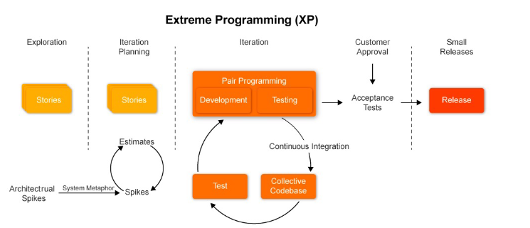
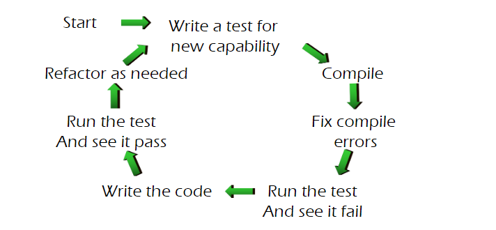
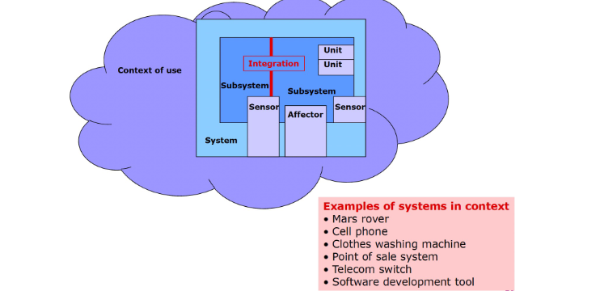
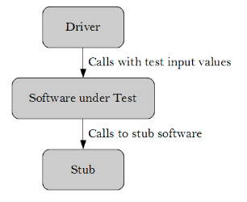
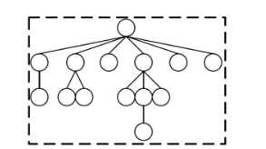
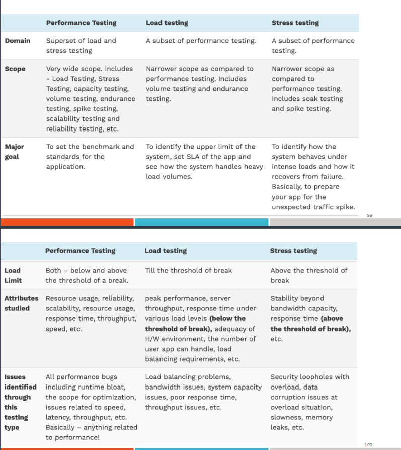
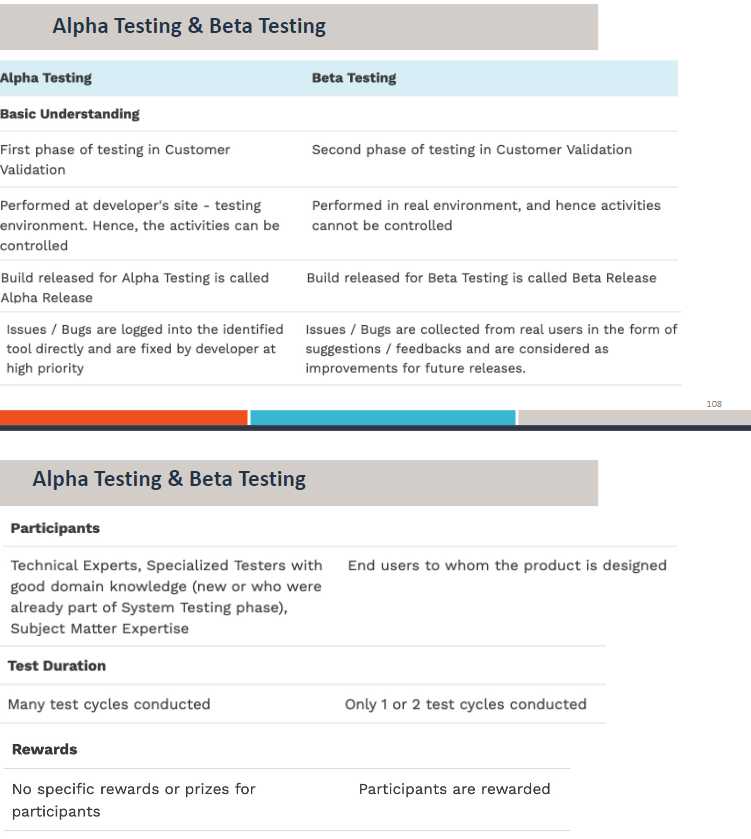
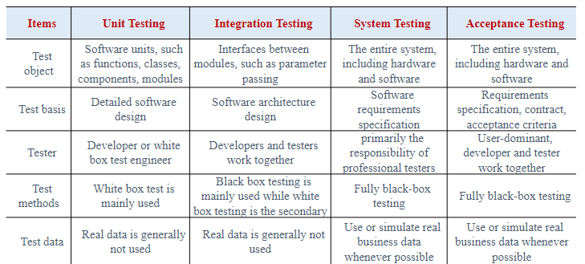

# 内容概览

1. Black-box and white-box testing, and related test case generation（黑盒、白盒以及测试用例的生成）
2. Testing team and testing documentation（测试团队和测试文档）
3. Tools for software testing（软件测试的工具）
4. Performance testing basics（性能测试基准）
5. Testing in the Software Process（对软件过程的测试）
   
# Introduction to Software Testing

1. Why do we test software?  
2. What is software?  
3. What is bug?  
4. Fault, Error and Failure  
5. Adverse Effects of Faulty Software  
6. The theory of Testing  
7. Verification and Validation  
8. Goals of Testing Software  
   
# Chapter 1 Introduction

1. 为什么做软件测试
	1. 什么是软件
	2. 什么是bug
	3. 区分Fault, Error and Failure
2. 测试理论
	1. Verification（验证） and Validation（确认） 
	2. 软件测试的目标

## 为什么做软件测试

### 什么是软件

一个软件系统通常由以下几个部分组成：

1. **程序中的指令**：分散在各个程序中的指令-当执行这些指令时，可以实现某些期望的功能。

2. **数据结构**：这些结构使程序能够适当地操作和处理信息。

3. **配置文件**：这些文件用于设置和配置程序的运行环境。

4. **系统文档**：这些文档描述了系统的结构，包括其组成部分和工作原理。

5. **用户文档**：这些文档解释了如何使用系统，并可能包括用户可以下载最新产品信息的网站。
   
### 软件的早期

### 什么是BUG

Bug是一个非正式使用的术语，通常指软件中的缺陷或问题。

## Fault, Error and Failure

### Fault

软件中的静态缺陷（比如代码编码错误）

1. 算法错误
2. 语法错误
3. 文档不完全或者正确
4. stress

### Error

不正确的内部状态，是某fault的具体体现

### Failure

软件外部行为不符合需求或预期行为的情况。（输出不符合预期）

### PIE Model

#### 执行/可达性（Execution/Reachability）

**解释**：测试可能不会执行到故障所在的位置。

**要求**：程序中包含faults的位置必须是是可以到达的

#### 感染（Infection）

**解释**：即使测试执行到了故障，程序状态也可能不会变得不正确。

**要求**：执行故障后，程序的状态必须变得不正确。这意味着故障必须对程序的内部状态产生影响，导致错误的状态。

#### 传播（Propagation）

**解释**：错误可能不会传播到程序的输出

**要求**：被感染的状态必须传播，导致程序的某些输出不正确。

## 测试理论

### Validation (验证) 和Verification（确认）

IV&V 是 “independent verification and validation”的缩写

#### Verification（验证）

用于确定软件开发过程某个阶段的产物是否满足在**前一阶段设定的要求**的过程。

软件是否满足需求？

#### Validation（确认）

确认是一个过程，用于在**软件开发结束时**评估软件，以确保其符合预期的使用要求。

软件需求是否满足预期使用

### 软件测试公理

1. 不可能完全测试一个程序：输入、输出、路径说明书存在解释空间（有歧义）。
2. 软测是基于风险的活动：根据风险评估决定哪一个部分需要更加深入的测试，有效利用资源。需要在bug发现量和测试成本之间做一个权衡，取最优点。
3. 测试不能证明没有BUGs：只能说明bugs的出现
4. 发现的bug越多，可能存在的bug也越多。当出现一个的时候，可能发现更多：
	1. 程序员可能状态不佳
	2. 程序员往往会犯相同的错误
	3. 有些bug只是冰山一角
5. 不是所有的bug会被修复
	1. 时间不充分
	2. 其实并不是一个bug
	3. 修复bug风险太高
	4. 不值得这样做
		1. 为什么不在下一个版本中收取bug修复费用？
		2. 边缘功能的bug修复需要等待修复
6. 很难定义一个bug确实是一个bug，需要严格判断
	1. 如果没有人发现，那么算是一个bug吗
	2. 未被发现的bug是属于潜在bug
7. 规格说明书没有最终版本。会随着需求变化、时间和变化，测试人员需要进行适应。
	1. 基于“移动目标”规格构建产品是软件开发中特有的现象。
		- 竞争激烈
		- 发布周期非常快
		- 软件“容易”改变
	2. 例如，布鲁克林大桥一旦开始建造，就无法调整以允许火车通过。
8. 测试者不是项目中最受欢迎的成员
	1. 尽早发现bugs
	2. 以专业方式进行汇报
	3. 不要只汇报坏消息
9. 软件测试是一个纪律严明且技术性强的职业。以往，测试人员往往未经培训，测试也不是以系统的方法进行的。现在，构建有缺陷的软件代价太高。因此，测试已经发展成为一门成熟的学科。
    - 复杂的技术
    - 工具支持
    - 有前途的职业发展

### 软件测试者的目标

1. 找到bugs
2. 尽可能早地发现bugs
3. 确保bugs被修复

#  Chapter 2 Testing in the Software Process

1. Waterfall Model
2. Spiral Model 
3. V Model 
4. W Model 
5. Agile Model - XP

## 瀑布模型

1. 所有的计划在一开始就确定，一旦确定就不会更改
2. 在任何一个子阶段都没有交叉重叠
3. 通常在测试完成后，才是第一次**看到**程序：在瀑布模型中，软件的实际功能通常在开发的最后阶段（即测试阶段）才会被完整地展示出来。这意味着在项目的早期阶段，利益相关者和用户可能无法看到软件的任何部分，直到测试完成。这可能导致在项目后期发现重大问题时，修复成本较高。

## Spiral Model（螺旋模型）

1. 风险驱动的发展过程
2. 结合瀑布模型和快速原型迭代模型
3. 以**设计目标**为始，以客户**评审**进展结束

| 优点                       | 缺点                        |
| ------------------------ | ------------------------- |
| 可以在后期添加额外功能或进行更改         | 存在无法按计划或预算完成的风险           |
| 由于原型构建是分小块进行的，因此成本估算变得容易 | 螺旋开发仅适用于大型项目，并且需要风险评估专业知识 |
| 持续或重复开发有助于风险管理           | 为了顺利运行，必须严格遵循螺旋模型协议       |
| 开发速度快，功能以系统化的方式添加        | 文档较多，因为有中间阶段              |
| 始终有客户反馈的空间               | 螺旋软件开发不建议用于小型项目，因为可能成本过高  |

这种表格格式可以帮助更清晰地比较螺旋模型的优缺点。

## V Model（V模型）

1. **瀑布模型的扩展**：

    - 这种扩展版本在传统瀑布模型的基础上，增加了对验证和确认的关注。它强调在每个开发阶段都要进行相应的测试活动，以确保每个阶段的输出符合预期。

2. **测试的开始**：

    - 在代码实现完成后，测试过程正式开始。这意味着开发和测试是分阶段进行的，测试在开发完成后才开始。

3. **测试的层次**：

    - 测试从最基本的单元测试开始，逐步进行更高级别的测试，如集成测试、系统测试，最终到达验收测试阶段。每个测试阶段都旨在验证和确认软件的不同方面，以确保最终产品符合需求和规格。

| 优点                    | 缺点                             |     |
| --------------------- | ------------------------------ | --- |
| 由于模型的严格性，简单且易于管理      | 像瀑布模型一样，在**生命周期的后期**才会产生可工作的软件 |     |
| 鼓励在所有阶段进行验证和确认        | 不适用于需求有**中等到高风险变化**的情况         |     |
| 每个阶段都有特定的**交付物和评审过程** | 被认为不适合长时间、复杂和面向对象的项目           |     |
| 在开发过程中给予测试同等的重视       |                                |     |
## W Model（W模型）

- V模型的扩展/双V模型
- 测试不是在代码实现之后进行的。
- 测试过程与开发过程并行进行。
- 开发和测试之间的合作。
- 测试不仅仅是测试用例的构建、执行和评估。

## Agile Model - XP（敏捷模型 - 极限编程）

敏捷方法与其他增量开发方法一样，强调在**短时间**内构建可发布的软件。

- 然而，敏捷开发与其他开发模型的不同之处在于其时间周期**以周为单位**，而不是月，并且工作是在高度协作的方式下进行的。

为了有效的测试：

- 当开发人员与客户“协商”即将到来的迭代需求时，测试人员必须充分参与这些对话。
- 测试人员立即将这些对话中商定的需求转化为测试用例。
- 当需求发生变化时，测试人员立即参与，因为测试用例必须相应地更改。

### 极限编程

**极限编程**（XP）是敏捷软件开发理念的一个子集。  

- 它强调代码审查、持续集成和自动化测试，以及非常**短的迭代周期**。  
- 它倾向于**持续的设计改进（或重构）**，而不是一个大型的初始设计阶段，保持当前**实现尽可能简单。**  
- 它更倾向于实时沟通，最好是**面对面**的，而不是撰写文档，并且将**可工作的软件**视为进度的主要衡量标准。  
- 该方法还强调**团队合作**。管理者、客户和开发人员都是致力于交付高质量软件的团队的一部分。  
- **程序员**负责测试自己的工作；**测试人员**则专注于帮助客户选择和编写功能测试，并定期运行这些测试。

**极限编程的价值**：

- **沟通**：XP 程序员与客户和其他程序员沟通。
- **简单性**：保持设计简单和干净。
- **反馈**：从一开始就通过软件测试获取反馈。
- **勇气**：尽早将系统交付给客户；根据建议实施更改，勇敢地应对不断变化的需求。

### TDD - Test-Driven Development

开发人员在编写代码之前先编写测试用例。开发过程遵循“红-绿-重构”循环：首先编写一个失败的测试（红），然后编写代码使测试通过（绿），最后重构代码以优化设计

### User Stories and Story Card

**User Story**是用户使用一两句日常使用的句子描述软件系统需要完成的一个方面。

按一定顺序书写在纸上就是**Story Card**

#  Chapter 3 Principles of Software Testing

## Static and Dynamic Verification

静态验证不需要执行代码，但是动态验证需要执行代码。

### 静态验证（Static Verification）

静态验证是一种在不执行程序代码的情况下检查软件正确性的方法。它通常包括以下两种方法：

1. **符号执行（Symbolic Execution）**：这是一种数学方法，通过符号而不是实际值来执行程序。符号执行可以帮助识别程序中的潜在错误和逻辑缺陷。
2. **形式化（符号）验证（Formal Verification）**： 这是一种验证规格说明和源代码之间翻译正确性的正式方法。形式化验证可以确保程序在所有可能的输入情况下都符合其规格说明。

### 动态验证（Dynamic Verification）

动态验证是指在程序执行时进行的验证活动，包括黑盒测试和白盒测试。它通过运行软件并观察其行为来验证软件的正确性。

**动态验证**：通过执行代码来进行验证，包括黑盒测试和白盒测试。

## Black and White Box Testing

- **黑盒测试（Black-box Testing）**：关注软件的功能，而不考虑内部实现。测试人员根据**规格说明来设计测试用例**，验证软件是否按预期工作。黑盒测试通常被认为是动态验证的一部分，因为它涉及执行程序并观察其输出。
- **白盒测试（White-box Testing）**：关注软件的**内部结构和实现**。测试人员需要了解代码的内部逻辑，以设计测试用例来覆盖代码的不同路径。白盒测试也属于动态验证，因为它需要执行代码来验证其行为。

#  Chapter 4 BlackBox Testing

1. Equivalence Partitioning 
2. Boundary Value Analysis 
3. Combinational Testing
4. Random Testing and Error Guessing
5. Scenario Testing

### Equivalence Partitioning

**等价类-Equivalence Partition, EP**是指对于某个参数，其规格说明指出等效处理的一组值范围。

**等价类划分**是通过系统地减少大量（或无限）的可能测试用例集为一个小而有同样有效的测试用例集的过程。

等价类形成一个集合的划分-**Partition**。划分(**Partition**)：一组互不相交的子集的集合。

- **有效等价类**：
    - 输入字段中的一组有意义的数据。
    - 用于验证系统功能和性能的正确实现。
- **无效等价类**：
    - 输入字段中的一组无意义的数据。
    - 用于测试系统的容错能力。

#### 识别测试用例的步骤

1. **从规格说明中识别输入/输出**：
   - 例如，表单中的输入字段、命令行程序的输入、输出消息、计算结果等。
2. **为识别的输入/输出确定等价类**：
   - 对于一个范围，确定1个有效类（在范围内）和2个无效类（范围两端之外的各一个）。
   - 如果输入是一组有效值，确定1个有效类（来自集合内）和1个无效类（集合外）。
   - 如果输入是一组值且程序对输入值有不同处理，为每个允许的输入确定1个有效类，并确定1个无效类（所有不允许的输入的集合）。
   - 对于布尔值，确定1个有效类（true）和1个无效类（false）。
   - 对于必填输入，确定空（无效）和有效输入。
   - 如果输入必须遵循规则，确定1个有效类（符合规则）和若干无效类（以不同方式违反规则）。

将每个输入划分为等价类，并形成等价类表，为每个等价类指定一个唯一的ID。

### Boundary Value Analysis

#### 边界条件

边界条件是指**软件计划操作限制的边缘情况**。例如，从负数到零再到正数，超过表单输入字段的长度等。

1. 在制定等价类时，选择位于边界上的输入数据。
2. 测试边界内的有效数据。
3. 测试最后一个可能的有效数据。
4. 测试边界外的无效数据。

#### 边界值分析

- **等价类**：外部点和内部点。
- **选择边界值**：
  1. 每个参数在每个等价类的顶部和底部都有一个边界值。
  2. 对于连续数据类型，一个分区顶部值的后继值必须是下一个分区的底部值。
  3. 参数的自然范围提供了最终的最大值和最小值。

#### 常见边界值

- 循环结构中的 0、1 和最后一次循环。
- 数组的第一个和最后一个元素。
- 变量类型允许的最大值和最小值。
- 链表的第一个和最后一个节点。
- 可接受字符的最大和最小数量，例如用户名和密码。
- 表格/报告的第一行、第一列、最后一行和最后一列。

通常，软件测试涉及多种类型的边界检查：数字、字符、位置、重量、大小、速度、方向、维度、空间等。

相应地，上述类型的边界值应包括：最大/最小、第一/最后、上/下、最快/最慢、最高/最低、最短/最长、空/满等。

### Combinational Testing

- **技术**：有多种不同的技术用于识别相关的组合，例如**因果图、决策表和真值表**。
  
- **组合分析**：组合分析涉及识别软件**输入原因（causes）** 的所有不同组合及其相关的**输出效果-effects**。
  
- **原因和效果**：原因和效果被描述为**逻辑语句（或谓词）**，基于软件的规格说明。这些表达式指定了特定变量导致特定效果所需的条件。
#### Decision Tables

- **关联条件与要执行的动作**：将条件与需要执行的动作相关联。
  
- **优雅地关联多个独立条件与多个动作**：可以以一种优雅的方式将许多独立的条件与多个动作相关联。

### Random Testing和Error Guessing

#### Random Testing

- **随机数生成器**：测试数据是使用随机数生成器生成的。分布可以是均匀的，或者在统计意义上选择模拟程序在实际使用中将接收到的输入类型。

- **规格说明**：如果规格说明写得清晰且全面，那么应该可以找到可能输入值的集合。

- **目标**：目标是基于输入参数的分布，实现对每个输入参数可能值的“合理”覆盖。这可以通过启发式方法确定（例如，使用10个随机值），或者基于从所需覆盖置信度中确定的统计样本大小来确定。

#### Error Guessing

这是一种基于**直觉和经验**的即兴方法。

**测试数据选择**：选择可能暴露代码中错误的测试数据。以下是一些可能导致问题的典型输入示例：

  - 空或 null 字符串、数组、列表和类引用。这些可能会发现代码在使用之前没有检查空值或非 null 值。
  - 零作为值，或作为实例或事件的计数。这些可能会发现除以零的错误。
  - 字符串中的空格或 null 字符。这可能会发现代码未正确处理字符串或在尝试从字符串中提取数据之前未修剪空白。
  - 负数。这些可能会发现代码中只期望接收正数的错误。

**目标**：目标是覆盖尽可能多的值，这些值**根据测试人员的经验**可能会暴露代码中的错误。

### Scenario Testing

**定义**：场景测试是一种软件测试技术，它使用**场景（即假设的故事）** 来帮助测试人员解决复杂问题或测试系统。

**目的**：场景测试的目的是确保软件的**端到端功能和所有流程**都能正常工作。

**场景测试目标**：
- 模拟用户完成正常功能和核心业务逻辑的操作，以验证软件功能的正确性。
- 模拟用户操作中的主要错误，以验证软件的异常错误处理能力。

**方法**：在场景测试中，测试人员将自己**假设为最终用户**，并寻找最终用户可能在软件上执行的**真实场景或用例**。

#### Basic flow and Alternative flow

##### Basic Flow

- 最简单的用例路径，即没有任何错误，程序直接从过程的开始到结束。
- 大多数用户使用的操作过程，反映软件的主要功能和流程。
- 一个业务只有一个基本流程，并且基本流程只有一个开始和一个结束。

##### Alternative Flow

- 从基本流程开始，在特定条件下执行，然后重新加入基本流程（例如，替代流程1和3）。
- 或者从另一个替代流程开始（例如，替代流程2）。
- 用例也可以在不加入基本流程的情况下终止（例如，替代流程2和4）。
- **反映各种异常和错误条件。**

#### Scenario Testing Steps

替代流程，如程序执行路径，会导致**场景爆炸**。需要选择典型场景进行测试。

1. 只有一个场景包含基本流程；
2. 最小场景数量=基本流程和替代流程的总和；
3. 对于一个替代流程：至少一个场景覆盖它，尽量避免覆盖其他替代流程。

**测试步骤**:

1. 根据规格说明，描述被测软件的**基本流程和替代流程**。
2. **构建不同的场景**以满足测试的完整性和无冗余性要求。
3. 为每个场景**设计相应的测试用例**。
4. 重新检查所有生成的测试用例并删除冗余的测试用例。在确定测试用例后，为每个测试用例**确定测试数据值**。

## 黑盒测试策略总结

1. **针对特定功能页面的特定输入字段**，使用等价类和边界值进行精细测试；使用静态测试检查按钮、链接、内容、图像等。
2. **如果功能描述包含输入条件的组合且业务逻辑复杂**，可以使用决策表。
3. **在任何情况下都应考虑边界值分析**，因为它是发现软件缺陷的最有效方法之一。
4. **可以通过错误猜测法扩展测试用例**，并强调测试工程师的宝贵经验。
5. **对于业务流程明确的系统**，可以在整个测试过程中使用场景测试。

# Chapter 5 White-Box Testing

Control Flow Testing

- **定义**：控制流测试是一种结构化测试策略，它使用程序的控制流作为模型。
- **要求**：要求测试人员对程序的逻辑结构有清晰的理解，甚至能够掌握源程序的所有细节。
- **适用性**：最适用于新软件的单元测试。

1. Statement Coverage 
2. Decision Coverage 
3. Condition Coverage 
4. Decision Condition Coverage 
5. Condition Combination Coverage 
6. Path Coverage 
7. Basis Path Testing

## Statement Coverage

**设计测试用例**：设计测试用例并确定所需的输入值，以确保每个源代码语句都被执行。

**别名**：也称为点覆盖。

**覆盖强度**：这是最弱的逻辑覆盖，应与其他测试方法交互使用。

## Decision Coverage (Branch Coverage)

**设计测试用例**：设计测试用例并确定所需的输入值，以确保每个源代码分支都被执行。

**执行要求**：程序的每个真和假分支至少被执行一次。

**别名**：也称为边覆盖。

## Condition Coverage

**复杂决策**：复杂决策由多个（布尔）条件组成。

**扩展分支覆盖**：条件覆盖通过确保在复杂决策中，每个条件的真值和假值都被测试来扩展分支覆盖。

**注意事项**：不要求决策本身必须取真值和假值！

**测试数据选择**：选择测试数据以确保每个决策中的每个条件都取真值和假值。

## Decision/Condition Coverage

- **生成测试数据**：生成测试数据，以便在一个决策中的所有条件（如果可能）至少取一次两种结果，并执行每个决策的真和假结果。
  
    - 每个决策都有真和假的测试用例。
    - 此外，决策中的每个条件都有真和假的测试用例（如果可能）。

- **组合**：这是条件覆盖和分支测试的组合。它使用与条件覆盖相同的测试数据，但必须额外确保每个分支或决策取真或假结果。
  
    - 单一条件决策：2个测试用例。
    - 2个条件的决策：2个以上的测试用例。

## Condition Combination Coverage 

**生成测试**：生成测试以导致每个决策的条件的每种可能组合被测试。

**目标**：实现每个决策的100%覆盖和每个条件的100%覆盖。

**方法**：真值表是识别所有可能值组合的最佳方法。

## Control Flow Graphs (CFGs)

能够创建控制流图对于路径测试技术至关重要。

- **有向图 G(V, E)**：
  
    - V 是顶点的集合。
    - E 是边的集合，E = V*V。
- **表示控制流**：
  
    - 每个节点代表一个或多个语句。
    - 每条边代表一个“跳转”或“分支”。
    - 两个出口表示一个决策（真或假）。

## Path Coverage 

- **生成测试数据**：生成测试数据以执行程序中的所有不同路径。这被称为“路径覆盖”。
- **路径覆盖**：路径覆盖要求在测试执行期间，从程序的入口到出口的每一条可能路径都被执行。
- **目标**：实现代码中每条从开始到结束路径的100%覆盖。
- **路径迭代**：通过循环进行 i 次迭代的路径与进行 i+1 次迭代的路径是不同的，即使在两次迭代中访问的是相同的节点。因此，在某些程序中可能存在无限多的路径！

### 限制路径数量

- **选择路径的等价类**：需要限制路径的数量，选择路径的等价类。
- **等价路径**：如果两条路径仅在循环迭代次数上有所不同，则它们被视为等价，形成两类循环：
    - 一类是0次迭代
    - 一类是n次迭代（n > 0）
- **其他等价路径**：如果需要，也可以选择其他等价路径。

- **CFG描述**：程序的控制流图可以用正则表达式描述，使用以下操作：
    - `.` 表示节点序列的连接
    - `+` 表示图中的**决策**（即if语句）
    - `*` 表示迭代（0次或多次，例如while语句）
## Basis Path Testing

- **定义**：基本路径测试是一种白盒测试方法，其中测试用例是基于程序中可以采取的流或逻辑路径定义的。
- **目标**：基本路径测试的目标是**定义独立路径的数量**，以便明确需要的测试用例数量，从而最大化测试覆盖率。
- **执行**：基本路径测试涉及执行程序中的所有可能块，并以最少的测试用例实现最大路径覆盖。

### 基本路径测试步骤

1. **绘制控制流图**：确定不同的程序路径。
2. **计算圈复杂度**：用来确定独立路径的数量的度量。
	- **三种计算方法**：
	    - V(G) = E - N + 2，E = 边的数量，N = 节点的数量
	    - V(G) = P + 1，P = 决策节点的数量（包含条件的节点）
	    - V(G) = R，R = 区域的数量
3. **找到基本路径集**。
4. **生成测试用例**：执行每条路径。

### 复合条件分解

- **分解复合条件**：如果包含复合条件，则应将其分解为几个简单条件。
- **简单条件**：每个简单条件对应于流程图中的一个节点。

# Chapter 6: Static Testing

- Code Review
- Static Program Analysis

静态测试是在不执行软件的情况下，仔细而系统地审查和分析软件以查找错误的过程。

- **代码审查**
- **静态程序分析**

这种测试形式非常有价值，相较于基于执行的测试具有优势。经验表明，使用静态测试可以发现大量的错误。

- **成本和生产力的好处**：因为错误在早期被发现（并纠正），并且基于执行的测试所需的时间更少。

## 静态程序分析

**自动化工具**：静态程序分析通常使用自动化工具来检查代码。这些工具可以扫描代码以查找潜在的错误、代码风格问题、安全漏洞和性能问题。
## Code Review

### 代码审查的基本要素

- **识别问题**：查找软件中的问题，如遗漏项、错误等。
- **遵循规则**：规定要审查的代码量、花费的时间等。
- **准备**：每个参与者都应准备好以便为审查做出贡献。
- **撰写报告**：总结审查结果，并将报告提供给开发团队。

### 非正式代码审查

- **同行评审**：
  
    - 一个非正式的小组，由程序员和/或测试人员担任审查者。
    - 即使审查是非正式的，参与者也应遵循4个基本要素。

- **走查**（walkthrough）：
  
    - 一个更正式的过程，**代码作者**正式向一小组程序员和/或测试人员展示代码。
    - 作者逐行阅读代码并解释其功能，审查者倾听并提问。
    - 参与者应遵循4个基本要素。

### 正式代码检查

- **检查比走查更全面**：
  
    - 代码展示者不是代码的作者。
    - 其他参与者是检查员。
    - 有一位主持人确保规则被遵循，会议顺利进行。

- **检查后**：撰写报告。程序员然后进行更改，并在必要时进行重新检查。
  
- **正式代码检查**：在发现代码和设计中的错误方面非常有效，并且越来越受欢迎。

# Chapter 7: Test Plan and Test Case

- Test Plan 
	- Process for planning 
	- Test plan components 
- Test Case

## Test Plan

### 测试计划

测试计划是描述**软件测试范围和活动的文档**。它是正式测试项目中任何软件/产品的基础。

- **内容**：包括预期测试活动的范围、方法、资源和时间表。

### 主测试计划

- **定义**：一个项目/产品的单一高级测试计划，用于统一所有其他测试计划。

### 测试级别

  - 单元测试计划
  - 集成测试计划
  - 系统测试计划
  - 验收测试计划

### 测试类型

**测试计划**：针对特定类型测试的测试计划，如性能测试计划和安全测试计划。

### Test Planning Process

1. Define test strategy 
2. Define test system 
3. Estimate test effort 
4. Prepare and review test plan

## Test Case

**测试用例**是一个文档化的集合，包括前提条件（先决条件）、过程（输入/操作）和后置条件（预期结果），测试人员使用它来判断被测系统是否满足要求或正常工作。

- **测试脚本**：一个测试用例可以包含一个或多个测试脚本。
  
    - 测试脚本是执行测试的一系列指令。

- **测试套件**：一组测试用例的集合称为测试套件。

# Chapter 8: Unit Testing

1. What do we test? 
2. Unit Testing 
3. Test-Driven Development (TDD)
4. Automated Unit Testing

## What do we test

## Unit Testing

单元测试主要是由开发人员编写的白盒测试，旨在验证程序功能的小单元。

- **关键比喻：集成电路测试**：集成电路在整个电路测试之前会单独进行功能测试。

- **定义**：
    - **白盒**：单元测试是在对实现细节完全了解的情况下编写的。
    - **开发人员**：单元测试由开发人员（即你）在实现的同时编写。
    - **小单元**：单元测试应一次隔离一个软件片段进行测试。
        - 例如，单个方法和类。
- **验证**：确保你“正确地构建了软件”。测试是针对合同进行的。
    - 这与确认（validation）形成对比

### Role of Unit Testing

#### 帮助定位错误

- **定位错误**：失败表明被测单元存在问题。

#### 早期发现错误

- **早期发现**：单元测试在开发过程中编写，通常由开发人员完成。
- **成本效益**：由其他团队在后期发现的缺陷修复成本更高。

#### 避免不必要的功能

- **测试驱动开发**：先编写测试，只编写足够的代码以使其工作。

#### 提高代码质量

- **代码质量**：帮助开发人员交付可工作的代码。
- **质量保证**：在集成到系统之前确保单元的最低质量。

## 测试驱动开发（TDD）

**先写测试**：在编写代码之前编写测试。
    
- 帮助在编写代码时考虑边界情况。
- 帮助考虑接口设计。

**代码编写**：仅在自动化测试失败时编写代码。
    
**修复错误**：如果通过其他方式发现错误，首先编写一个失败的测试，然后修复错误。

- 确保错误不会再次出现。

**频繁运行测试**：理想情况下，每次代码更改时都运行测试。

- 完善的单元测试允许自信地重构代码。
- 没有单元测试，代码很脆弱——更改可能会破坏客户端！

### 测试驱动开发的优势

**实践推广**：由迭代和敏捷的XP方法推广，也称为测试优先开发。

**优势**：

- 单元测试确实被编写。
- 程序员满意度提高，导致更一致的测试编写。
- 界面和行为的详细澄清。
- 可证明、可重复、自动化的验证。
- 改变事物的信心。

### 自动化单元测试

**测试框架**：帮助管理和运行单元测试的工具。
    
 **xUnit框架**：JUnit（Java）、CppUnit（C++）、NUnit（.Net）。
    
**良好单元测试的三个属性**：
    
- **自动化**：测试应易于运行并检查正确完成。
	- 这使开发人员能够快速确认代码在更改后正常工作。
- **可重复**：任何开发人员都可以运行测试，并且它们会立即工作。
- **独立性**：测试可以按任何顺序运行，并且仍然有效。

### 概念

- **断言（Assertions）**
    
    - 布尔表达式，用于比较预期结果和实际结果。
    - 基本且最小的构建块。
    - 通用形式：ASSERT（预期结果，实际结果）。

- **测试用例（Test Case）**
    
    - 一个扩展了 "TestCase" 的类。
    - 具体测试过程的组合。
    - 可能包含多个断言，并测试多个测试目标。
    - 例如，某个特定功能的所有测试。

- **测试套件（Test Suite）**
    
    - 相关测试用例的集合。
    - 可以通过一个命令自动执行。

# Chapter 9 : Integration Testing

1. 什么是集成测试
2. 集成测试的方法
3. 基于分解的集成

### 定义 – 集成测试

- **集成测试数据**：选择集成测试数据以确保系统的组件或子系统能够正确地协同工作。
- **测试用例**：测试用例将探索**组件之间的不同交互**，并确保产生正确的结果。

### 集成测试 – 驱动程序和桩模块

**驱动程序和桩模块**：是临时的软件组件。
- **测试驱动程序**：调用被测软件，将测试数据作为输入传递。
- **手动测试**：在系统接口尚未完成的情况下，使用测试驱动程序来提供测试用户与被测软件之间的接口。

### 驱动程序和桩模块

**驱动程序（Drivers）**

  - 驱动程序可以有不同程度的复杂性。
  - 它可以是硬编码的，以运行一系列固定的输入值，或者从准备好的文件中读取数据，或者包含合适的随机数生成器等。

**桩模块（Stubs）**

  - 桩模块是被测软件所需的临时或虚拟软件，以便其正常运行。
  - 这是一个用于允许测试进行的临时版本。
  - 它将提供一组固定或有限的值传递给被测软件。

### 基于分解的集成

根据系统的功能特性进行分解，功能特性由模块执行的动作或活动定义。

#### 大爆炸集成（Big bang integration）

- 将整个系统视为一个子系统。
- 在单个测试阶段测试所有模块。
- 只有一个集成测试阶段。
- 没有桩模块、驱动程序或策略。
- **故障隔离非常困难**。

#### 自顶向下集成（Top-down integration）

- 从树的根开始，逐渐向树的下层工作。
	- 第一步：检查主程序逻辑，将所有被调用的单元替换为总是返回正确值的桩模块。
		- 向下移动一级——每次用实际代码替换一个桩模块。
		- 任何故障都必须在新集成的单元中。
- 早期的系统原型开发。
- 临时代码编程。

#### 自底向上集成（Bottom-up integration）

- 自顶向下集成的反向。
	- 从功能分解树的叶子开始。
	- 驱动单元调用下一级单元，用输入“驱动”单元。
- 与自顶向下集成一样，每次用实际代码替换一个驱动单元。
- 任何故障（最有可能）在新集成的代码中。
- 较少的临时代码编程。
- **没有原型**，主程序最后测试。

#### 三明治集成（Sandwich integration）

- 结合自顶向下和自底向上方法。
- 通常，高级模块使用自顶向下方法（桩模块）。
- 通常，低级模块使用自底向上方法（驱动程序）。
- 测试向中间收敛。
- 集成会话的数量可以变化。
- 顶层和底层可以并行完成。
- 隔离问题非常困难

# Chapter 10: System Testing

**系统测试类型**：

- **功能测试**：验证软件的功能是否符合规格说明和用户需求。
- **非功能测试**：评估软件的性能、可用性、可靠性等非功能性要求。
- **回归测试**：确保新代码的更改没有引入新的错误，并且现有功能仍然正常工作。

## What is System Testing

测试**系统作为一个整体的行为**，针对场景和需求进行测试。

**假设所有组件已经正常工作**：集成测试已完成（通过将两个或多个相互依赖的软件模块作为一个组或（子）系统进行测试来检查软件质量）。

**使用黑盒测试技术**：

  - 将软件与顶级需求进行对比。
  - 测试源自需求中的具体用例。

**验证新的软件系统与现有环境的集成**：这可能包括其他系统、硬件、人员和数据库。

## 系统测试（功能性）

测试中的默认假设：

- **功能测试**：验证软件的行为是否符合预期。
- **包括测试不良输入**，以检查隐含假设：即，给定无意义的输入，程序应做出“合理的反应”。
- **贯穿所有测试级别，但主要集中在单元测试**：用于测试的接口是系统接口：用户界面、网络接口、专用硬件接口等。

**测试用例的选择基于黑盒测试**：

  - 场景测试、等价类划分、边界值分析、错误猜测、决策表测试、随机测试等的应用相对简单。
  - 像单元测试一样，使用所用技术选择测试用例和测试数据。
  - 唯一的区别是，不是用指定参数调用方法，而是必须将数据适当地输入到接口中，然后从接口收集结果。

## 系统测试（非功能性）

**大致上，测试不是“功能性”的东西**：

  - 通常，测试软件的质量，也称为“-ilities”：
    - 可用性
    - 可靠性
    - 可维护性
    - 安全性
    - 性能
    - 可移植性
    - 恢复性
    - 鲁棒性
    - ……

**非功能性测试是许多测试类型的总称**：

- 注意，这些并不都是互斥的！
- 并非所有这些都可能在产品上进行或适用于产品。

## 回归测试

- **确保代码更改没有破坏现有的功能、性能、安全性等**。
- **实际上，这意味着在代码更改后重新运行测试**。
- **有良好的测试自动化和良好的单元/集成/系统等测试，这实际上就是在更改后再次运行测试**。

## Performance Testing

简称为“性能测试”（Perf Testing），是一种测试类型，用于检查应用程序或软件在工作负载下的响应性和稳定性。

- **性能测试的目标**：识别并消除应用程序中的性能瓶颈。它是性能工程的一个子集。
- **测试目的**：主要用于检查软件是否满足对应用程序速度、可扩展性和稳定性的预期要求。
    - **速度**：确定应用程序是否快速响应。
    - **可扩展性**：确定软件应用程序可以处理的最大用户负载。
    - **稳定性**：确定应用程序在不同负载下是否稳定。

### 性能问题

- **长加载时间**：加载时间通常是应用程序启动所需的初始时间。通常应尽量减少。
- **响应时间差**：响应时间是从用户将数据输入应用程序到应用程序对该输入输出响应所需的时间。
- **可扩展性差**：当软件产品无法处理预期的用户数量或无法适应足够广泛的用户范围时，就会出现可扩展性差的问题。
- **瓶颈**：瓶颈是系统中的障碍，会降低整体系统性能。瓶颈是指由于编码错误或硬件问题导致在某些负载下吞吐量下降。通常通过修复运行不佳的进程或添加额外的硬件来解决瓶颈。
    - 一些常见的性能瓶颈包括：
        - CPU 利用率
        - 内存利用率
        - 网络利用率
        - 磁盘占用

### 性能测试类型

- **负载测试**：检查应用程序在预期用户负载下的性能。目标是在软件应用程序上线之前识别性能瓶颈。
- **压力测试**：在极端工作负载下测试应用程序，以查看其如何处理高流量或数据处理。目标是识别应用程序的崩溃点。
- **耐久性测试**：确保软件能够在长时间内处理预期负载。
- **峰值测试**：测试软件对用户生成的负载突然大幅增加的反应。
- **容量测试**：在容量测试中，大量数据被填充到数据库中，并监控整个软件系统的行为。目标是检查软件应用程序在不同数据库容量下的性能。

### 性能测试与负载测试与压力测试

性能测试是负载测试和压力测试的超集。

- **性能测试的主要目标**：包括建立系统的基准行为。
- **应用程序的基准和标准**：应根据速度、响应时间、吞吐量、资源使用和稳定性等属性进行设置。所有这些属性都在性能测试中进行测试。
- **暴露应用程序中的缺陷**：与缓冲区溢出、内存泄漏和内存管理不当等相关的缺陷。

**容量测试**是检查系统在面对一定数据量时的表现。因此，数据库被填充到其最大容量，并监控其性能水平，如响应时间和服务器吞吐量。

# Chapter 11: Acceptance Testing

- **什么是验收测试**
- **验收测试的内容**
- **Alpha 测试和 Beta 测试**
- **软件测试四个阶段的简要比较**

## What is Acceptance Testing（验收容忍度测试）

**定义**：验收测试是软件测试的最后一个阶段，系统在此阶段被测试以确保符合其业务需求。

**执行者**：由客户或最终用户执行，目的是查看产品是否适合交付。

**时机**：在系统测试之后、最终**交付给客户之前**进行。

**方法**：采用黑盒测试方法。

## Alpha 测试和 Beta 测试

- **定义**：Alpha 和 Beta 测试是验收测试类型（客户验证方法），有助于建立产品发布的信心，从而在市场上取得成功。
- **重点**：主要关注从已测试的产品中发现错误，并清晰展示产品被实时用户使用的情况。

### Alpha 测试

- **定义**：Alpha 测试是在开发者现场进行的验收测试形式。
- **执行者**：可以由内部开发人员和质量保证人员以及潜在的最终用户进行。
- **开放性**：Alpha 测试不对外开放。

### Beta 测试

- **定义**：Beta 测试（现场测试）是在客户或最终用户现场进行的验收测试形式。
- **时机**：在 Alpha 测试之后进行，并在没有开发人员在场或控制的真实环境中进行。
- **开放性**：Beta 测试或应用程序的 Beta 版本通常对全世界（或客户）开放。例如，微软公司最近发布了 Windows 10 的 Beta 版，并根据成千上万用户的反馈成功发布了稳定的操作系统版本。过去，苹果公司也曾公开发布 OS X 的 Beta 版，并根据用户反馈修复了许多小问题并改进了操作系统。

### Beta 测试和Alpha 测试对比

## Brief comparison of software testing phases

## Chapter 12: Bug Report and Test Summary Report

 - Tips for Software Testing Documentation 
 - Bug Report 
 - Test Summary Report

## 软件测试文档

列出一些我们需要定期使用/维护的软件测试文档：

1. 测试计划
2. 测试设计和测试用例规范
3. 测试策略
4. 每周状态报告
5. 用户验收报告
6. 风险评估
7. 测试日志
8. Bug 报告
9. 测试总结报告

## Bug 报告

- **定义**：Bug 报告是一个文档，概述了软件中存在的问题。
- **内容**：列出问题的原因或可见错误，以指出具体的问题所在，并包括解决问题的请求和/或详细信息。
- **要求**：Bug 报告需要清晰、可操作且易于完成。
- **目的**：编写缺陷报告（Bug 报告）的目的是为了修复 Bug。“这是我们目前的问题，这是我们应该有的结果，所以请修复它。”

### 一个好的 Bug 报告：

- 包含重现和修复问题所需的信息
- 是 Bug 报告者和接收者之间高效的沟通形式
- 能够并且尽快得到解决
- 发送给负责人
- 以定义的方式归档
- 为协作建立共同基础

## 测试总结报告

- **定义**：测试总结报告是测试项目结束时准备的重要交付物，或者说是在测试完成后准备的。
- **主要目标**：该文档的主要目标是向相关利益相关者（如高级管理层、客户等）解释项目测试的各种细节和活动。
- **重要性**：在进行详尽的测试后，发布测试结果、指标、最佳实践、经验教训、“上线”结论等非常重要，以作为测试执行和测试结论的证据。

# Chapter 13: Automated Testing-自动化测试

- **为什么我们需要自动化测试**
- **什么是自动化测试**

## 为什么我们需要自动化测试

**手动软件测试的缺点**：手动测试缓慢、容易出错且难以准确重复

1. 测试所有工作流程/所有字段/所有负面场景耗时。
2. 由于人类测试人员失去注意力，测试变得乏味且容易出错。
3. 当测试人员下班回家时，测试就结束了。

**软件测试的需求**：软件测试需要快速、准确和可重复

1. 频繁执行而不受时间限制。
2. 测试结果可以作为质量指标。
3. 可重复以允许回归测试。

## 什么是自动化测试？

**定义**：自动化测试是一种软件测试方法，通过特殊的自动化测试工具比较测试用例的预期结果和实际结果。

- 自动化执行测试或测试集合。
- 自动化收集结果。
- 自动化评估结果。
- 自动化生成报告。
- 自动化测量测试覆盖率

## 手动测试与自动化测试的关键区别

### 自动化测试的优点和缺点：

**优点**：

- **高投资回报率（ROI）和更快的上市时间**：
    - 支持重复测试用例的执行
    - 有助于测试大型测试矩阵
    - 允许并行执行
    - 鼓励无人值守的执行
    - 提高准确性，从而减少人为错误
    - 节省时间和金钱

**缺点**：

- 自动化工具通常很昂贵；
- 在测试应用程序的用户体验方面无效；
- 需要具备编码知识和经验。

# Chapter 14: Software Maintenance

1. What is Software Maintenance 
2. Types of Maintenance 
3. Evolutionary Design
4. Modifying Code

## 什么是软件维护

- **定义**：当从开发到演变的过渡不顺利时，交付后更改软件的过程通常称为软件维护。
- **修改程序**：在程序投入使用后进行修改。
- **架构变化**：维护通常不涉及对系统架构的重大更改。
- **实现更改**：通过修改现有组件和向系统添加新组件来实现更改。
- **理解程序**：维护需要对程序的理解。

## 维护成本（工作量）因素

- **团队稳定性**：如果同一团队成员持续参与，维护成本会更低。
- **合同责任**：如果系统的开发人员不负责维护，就没有动力为未来的更改进行设计。
- **员工技能**：维护人员通常缺乏经验，并且没有太多领域知识。
- **程序年龄和结构**：随着程序的老化，更改会降低代码、设计和结构的质量，使其更难理解和更改。

## 其他维护术语

- **可维护性**：软件可以被修改的难易程度。
- **连锁效应**：一个软件位置的更改可能会影响其他组件。
- **影响分析**：识别更改将如何影响系统其余部分的过程。
- **可追溯性**：在两个或多个软件工件之间建立关系的程度。
- **遗留系统**：仍在使用但开发团队不再活跃的软件系统。

## 维护与演变（Maintenance vs. Evolution）

- **软件维护**：保持软件系统在部署后正常运行所需的活动。
- **软件演变**：从较低级、较简单或较差的系统不断变化为更高级或更好的系统。

以下是这段话的翻译和整理：

## 维护类型

### 纠正性维护（Corrective Maintenance）

- **目的**：修复潜在错误
- **内容**：包括临时补丁和变通方法

### 适应性维护（Adaptive Maintenance）

- **目的**：响应外部变化
- **内容**：
  - 硬件平台的变化
  - 支持软件的变化

### 完善性维护（Perfective Maintenance）

- **目的**：改进交付的软件
- **内容**：
  - 用户增强
  - 效率提升

### 预防性维护（Preventative Maintenance）

- **目的**：提高（未来的）可维护性
- **内容**：文档编制、注释等
