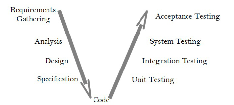
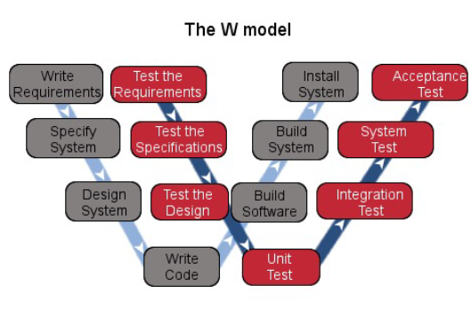

# 内容概览

1. Black-box and white-box testing, and related test case generation（黑盒、白盒以及测试用例的生成）
2. Testing team and testing documentation（测试团队和测试文档）
3. Tools for software testing（软件测试的工具）
4. Performance testing basics（性能测试基准）
5. Testing in the Software Process（对软件过程的测试）
   
# Introduction to Software Testing

1. Why do we test software?  
2. What is software?  
3. What is bug?  
4. Fault, Error and Failure  
5. Adverse Effects of Faulty Software  
6. The theory of Testing  
7. Verification and Validation  
8. Goals of Testing Software  
   
# Chapter 1 Introduction

1. 为什么做软件测试
	1. 什么是软件
	2. 什么是bug
	3. 区分Fault, Error and Failure
2. 测试理论
	1. Verification（验证） and Validation（确认） 
	2. 软件测试的目标

## 为什么做软件测试

### 什么是软件

一个软件系统通常由以下几个部分组成：

1. **程序中的指令**：分散在各个程序中的指令-当执行这些指令时，可以实现某些期望的功能。

2. **数据结构**：这些结构使程序能够适当地操作和处理信息。

3. **配置文件**：这些文件用于设置和配置程序的运行环境。

4. **系统文档**：这些文档描述了系统的结构，包括其组成部分和工作原理。

5. **用户文档**：这些文档解释了如何使用系统，并可能包括用户可以下载最新产品信息的网站。
   
### 软件的早期

### 什么是BUG

Bug是一个非正式使用的术语，通常指软件中的缺陷或问题。

## Fault, Error and Failure

### Fault

软件中的静态缺陷（比如代码编码错误）

1. 算法错误
2. 语法错误
3. 文档不完全或者正确
4. stress

### Error

不正确的内部状态，是某fault的具体体现

### Failure

软件外部行为不符合需求或预期行为的情况。（输出不符合预期）

### PIE Model

#### 执行/可达性（Execution/Reachability）

**解释**：测试可能不会执行到故障所在的位置。

**要求**：程序中包含faults的位置必须是是可以到达的

#### 感染（Infection）

**解释**：即使测试执行到了故障，程序状态也可能不会变得不正确。

**要求**：执行故障后，程序的状态必须变得不正确。这意味着故障必须对程序的内部状态产生影响，导致错误的状态。

#### 传播（Propagation）

**解释**：错误可能不会传播到程序的输出

**要求**：被感染的状态必须传播，导致程序的某些输出不正确。

## 测试理论

### Validation (验证) 和Verification（确认）

IV&V 是 “independent verification and validation”的缩写

#### Verification（验证）

用于确定软件开发过程某个阶段的产物是否满足在**前一阶段设定的要求**的过程。

软件是否满足需求？

#### Validation（确认）

确认是一个过程，用于在**软件开发结束时**评估软件，以确保其符合预期的使用要求。

软件需求是否满足预期使用

### 软件测试公理

1. 不可能完全测试一个程序：输入、输出、路径说明书存在解释空间（有歧义）。
2. 软测是基于风险的活动：根据风险评估决定哪一个部分需要更加深入的测试，有效利用资源。需要在bug发现量和测试成本之间做一个权衡，取最优点。
3. 测试不能证明没有BUGs：只能说明bugs的出现
4. 发现的bug越多，可能存在的bug也越多。当出现一个的时候，可能发现更多：
	1. 程序员可能状态不佳
	2. 程序员往往会犯相同的错误
	3. 有些bug只是冰山一角
5. 不是所有的bug会被修复
	1. 时间不充分
	2. 其实并不是一个bug
	3. 修复bug风险太高
	4. 不值得这样做
		1. 为什么不在下一个版本中收取bug修复费用？
		2. 边缘功能的bug修复需要等待修复
6. 很难定义一个bug确实是一个bug，需要严格判断
	1. 如果没有人发现，那么算是一个bug吗
	2. 未被发现的bug是属于潜在bug
7. 规格说明书没有最终版本。会随着需求变化、时间和变化，测试人员需要进行适应。
	1. 基于“移动目标”规格构建产品是软件开发中特有的现象。
		- 竞争激烈
		- 发布周期非常快
		- 软件“容易”改变
	2. 例如，布鲁克林大桥一旦开始建造，就无法调整以允许火车通过。
8. 测试者不是项目中最受欢迎的成员
	1. 尽早发现bugs
	2. 以专业方式进行汇报
	3. 不要只汇报坏消息
9. 软件测试是一个纪律严明且技术性强的职业。以往，测试人员往往未经培训，测试也不是以系统的方法进行的。现在，构建有缺陷的软件代价太高。因此，测试已经发展成为一门成熟的学科。
    - 复杂的技术
    - 工具支持
    - 有前途的职业发展

### 软件测试者的目标

1. 找到bugs
2. 尽可能早地发现bugs
3. 确保bugs被修复

# Chapter 2 Testing in the Software Process

1. Waterfall Model
2. Spiral Model 
3. V Model 
4. W Model 
5. Agile Model - XP

## 瀑布模型

1. 所有的计划在一开始就确定，一旦确定就不会更改
2. 在任何一个子阶段都没有交叉重叠
3. 通常在测试完成后，才是第一次**看到**程序：在瀑布模型中，软件的实际功能通常在开发的最后阶段（即测试阶段）才会被完整地展示出来。这意味着在项目的早期阶段，利益相关者和用户可能无法看到软件的任何部分，直到测试完成。这可能导致在项目后期发现重大问题时，修复成本较高。

## Spiral Model（螺旋模型）

1. 风险驱动的发展过程
2. 结合瀑布模型和快速原型迭代模型
3. 以**设计目标**为始，以客户**评审**进展结束

| 优点                       | 缺点                        |
| ------------------------ | ------------------------- |
| 可以在后期添加额外功能或进行更改         | 存在无法按计划或预算完成的风险           |
| 由于原型构建是分小块进行的，因此成本估算变得容易 | 螺旋开发仅适用于大型项目，并且需要风险评估专业知识 |
| 持续或重复开发有助于风险管理           | 为了顺利运行，必须严格遵循螺旋模型协议       |
| 开发速度快，功能以系统化的方式添加        | 文档较多，因为有中间阶段              |
| 始终有客户反馈的空间               | 螺旋软件开发不建议用于小型项目，因为可能成本过高  |

这种表格格式可以帮助更清晰地比较螺旋模型的优缺点。

## V Model（V模型）

1. **瀑布模型的扩展**：

    - 这种扩展版本在传统瀑布模型的基础上，增加了对验证和确认的关注。它强调在每个开发阶段都要进行相应的测试活动，以确保每个阶段的输出符合预期。

2. **测试的开始**：

    - 在代码实现完成后，测试过程正式开始。这意味着开发和测试是分阶段进行的，测试在开发完成后才开始。

3. **测试的层次**：

    - 测试从最基本的单元测试开始，逐步进行更高级别的测试，如集成测试、系统测试，最终到达验收测试阶段。每个测试阶段都旨在验证和确认软件的不同方面，以确保最终产品符合需求和规格。

| 优点                    | 缺点                             |     |
| --------------------- | ------------------------------ | --- |
| 由于模型的严格性，简单且易于管理      | 像瀑布模型一样，在**生命周期的后期**才会产生可工作的软件 |     |
| 鼓励在所有阶段进行验证和确认        | 不适用于需求有**中等到高风险变化**的情况         |     |
| 每个阶段都有特定的**交付物和评审过程** | 被认为不适合长时间、复杂和面向对象的项目           |     |
| 在开发过程中给予测试同等的重视       |                                |     |
## W Model（W模型）

- V模型的扩展/双V模型
- 测试不是在代码实现之后进行的。
- 测试过程与开发过程并行进行。
- 开发和测试之间的合作。
- 测试不仅仅是测试用例的构建、执行和评估。

## Agile Model - XP（敏捷模型 - 极限编程）

敏捷方法与其他增量开发方法一样，强调在**短时间**内构建可发布的软件。

- 然而，敏捷开发与其他开发模型的不同之处在于其时间周期**以周为单位**，而不是月，并且工作是在高度协作的方式下进行的。

为了有效的测试：

- 当开发人员与客户“协商”即将到来的迭代需求时，测试人员必须充分参与这些对话。
- 测试人员立即将这些对话中商定的需求转化为测试用例。
- 当需求发生变化时，测试人员立即参与，因为测试用例必须相应地更改。

### 极限编程

**极限编程**（XP）是敏捷软件开发理念的一个子集。  

- 它强调代码审查、持续集成和自动化测试，以及非常**短的迭代周期**。  
- 它倾向于**持续的设计改进（或重构）**，而不是一个大型的初始设计阶段，保持当前**实现尽可能简单。**  
- 它更倾向于实时沟通，最好是**面对面**的，而不是撰写文档，并且将**可工作的软件**视为进度的主要衡量标准。  
- 该方法还强调**团队合作**。管理者、客户和开发人员都是致力于交付高质量软件的团队的一部分。  
- **程序员**负责测试自己的工作；**测试人员**则专注于帮助客户选择和编写功能测试，并定期运行这些测试。

**极限编程的价值**：

- **沟通**：XP 程序员与客户和其他程序员沟通。
- **简单性**：保持设计简单和干净。
- **反馈**：从一开始就通过软件测试获取反馈。
- **勇气**：尽早将系统交付给客户；根据建议实施更改，勇敢地应对不断变化的需求。

### TDD - Test-Driven Development

开发人员在编写代码之前先编写测试用例。开发过程遵循“红-绿-重构”循环：首先编写一个失败的测试（红），然后编写代码使测试通过（绿），最后重构代码以优化设计

### User Stories and Story Card

**User Story**是用户使用一两句日常使用的句子描述软件系统需要完成的一个方面。

按一定顺序书写在纸上就是**Story Card**

# Principles of Software Testing

## Static and Dynamic Verification

静态验证不需要执行代码，但是动态验证需要执行代码。

### 静态验证（Static Verification）

静态验证是一种在不执行程序代码的情况下检查软件正确性的方法。它通常包括以下两种方法：

1. **符号执行（Symbolic Execution）**：这是一种数学方法，通过符号而不是实际值来执行程序。符号执行可以帮助识别程序中的潜在错误和逻辑缺陷。
2. **形式化（符号）验证（Formal Verification）**： 这是一种验证规格说明和源代码之间翻译正确性的正式方法。形式化验证可以确保程序在所有可能的输入情况下都符合其规格说明。

### 动态验证（Dynamic Verification）

动态验证是指在程序执行时进行的验证活动，包括黑盒测试和白盒测试。它通过运行软件并观察其行为来验证软件的正确性。

**动态验证**：通过执行代码来进行验证，包括黑盒测试和白盒测试。

## Black and White Box Testing

- **黑盒测试（Black-box Testing）**：关注软件的功能，而不考虑内部实现。测试人员根据**规格说明来设计测试用例**，验证软件是否按预期工作。黑盒测试通常被认为是动态验证的一部分，因为它涉及执行程序并观察其输出。
- **白盒测试（White-box Testing）**：关注软件的**内部结构和实现**。测试人员需要了解代码的内部逻辑，以设计测试用例来覆盖代码的不同路径。白盒测试也属于动态验证，因为它需要执行代码来验证其行为。

### BlackBox Testing

1. Equivalence Partitioning 
2. Boundary Value Analysis 
3. Combinational Testing
4. Random Testing and Error Guessing
5. Scenario Testing